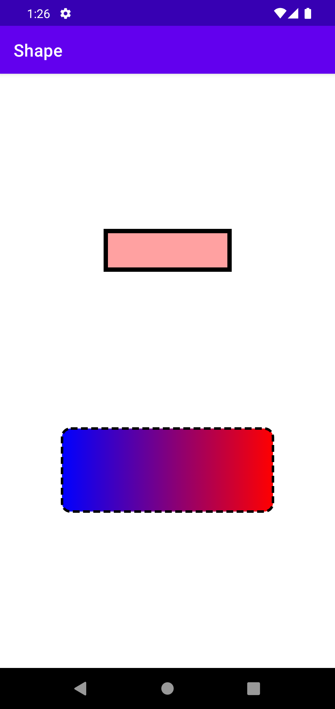

# Shape
## Red button
- 바탕: 빨강, 투명도 37%
- 가로: 150dp
- 세로: 50dp
- 테두리: 두께 - 5dp

## Gradation button
- 바탕: 파랑 -> 빨강 그라데이션
- 가로: 250dp
- 세로: 100dp
- 테두리: 점선 -> 실선(누를 경우), 두께 - 3dp, 모서리 - 둥글게 10dp

## 결과
