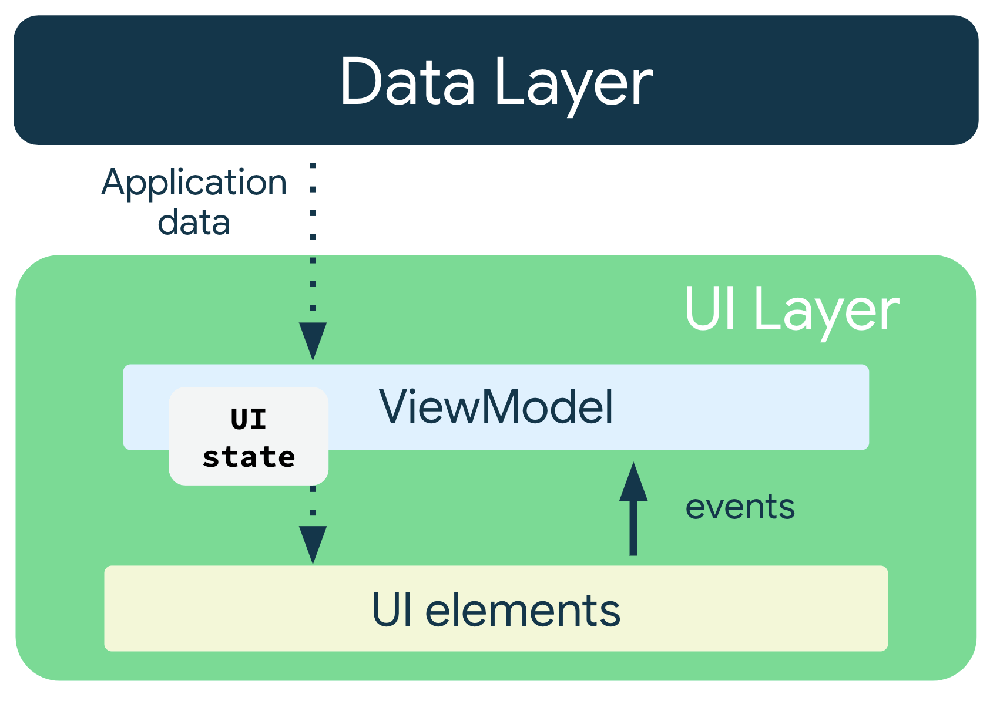
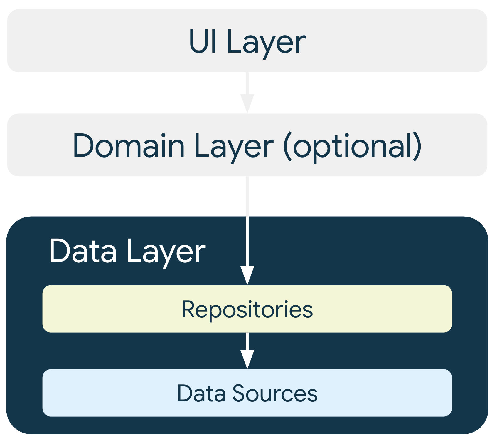

# 앱 분석
## 아키텍처
- https://developer.android.com/jetpack/guide?hl=ko
- UI Layer(UI elements, State holders(ViewModel))
  - 앱 데이터 변경사항을 UI가 표시할 수 있는 형식으로 변환한 후에 표시하는 파이프라인
  - UI = UI Elements + UI State
    - 데이터의 소스나 소유자만 노출되는 데이터를 업데이트해야
  - 단방향 데이터 흐름(UDF)으로 상태 관리
    
    - 상태가 아래로 향하고 이벤트는 위로 향하는 패턴
    - 비즈니스 로직은 상태 변경에 따라 진행해야 할 작업으로 도메인 또는 데이터 레이어에 배치
    - UI 로직은 상태 변경사항을 표시하는 방법
    - 데이터 일관성, 테스트 가능성, 유지 관리성
    - UI 상태 노출을 위해 ViewModel에서 LiveData 같이 관찰 가능한 데이터 홀더 노출 필요
    - UI 상태 스트림은 일반적으로 뷰모델에서 지원하는 변경 가능한(mutable) 스트림을 변경 불가능한 스트림으로 노출
    - 뷰모델은 상태를 내부적으로 변경하는 메소드를 노출하여 UI에서 사용할 수 있도록 함
    - UI 상태 객체는 서로 관련성 있는 상태를 함께 처리해야(단일 스트림 노출) -> 편의성, 데이터 일관성
    - 뷰모델에서 실행되는 모든 작업은 기본 스레드에서 안전하게 호출되어야 함 -> 장기 실행 작업의 경우 코루틴을 이용하거나 데이터 레이어 및 도메인 레이어가 다른 스레드로 옮기도록 함
- Domain Layer
  - UI Layer와 Data Layer 사이에 있는 **선택적** 레이어
  - 복잡한 비즈니스 로직, 여러 뷰모델에서 재사용되는 간단한 비즈니스 로직의 캡슐화를 담당, 저장소 결합에도 사용
- Data Layer
  - 비즈니스 로직이 포함된 레이어
  - 비즈니스 로직은 앱의 데이터 생성, 저장, 변경 방식을 결정하는 규칙으로 구성
  - 여러 개의 데이터 소스를 각각 포함할 수 있는 저장소로 구성

  - Repository 클래스는 데이터 영역의 진입점
    - 앱의 나머지 부분에 데이터 노출(변경 불가)
    - 데이터 변경사항을 한 곳에 집중
    - 여러 데이터 소스 간 충돌 해결
    - 데이터 소스의 추상화
    - 비즈니스 로직 포함
  - Data Source 클래스는 파일, 네트워크, 로컬 DB 같이 하나의 데이터 소스만 사용해야
    - Data Source는 항상 일관되고 정확하며 최신 상태인 데이터 포함(repository에서 노출되는 데이터는 항상 Data Source에서 직접 가져온 데이터여야)
  - Repository와 Data Source 호출은 기본 스레드에서 호출하기 안전하도록 기본 안전성이 보장되어야 함
    - Room, Retrofit 같은 라이브러리 사용하면 정지 메소드 호출과 같은 기본 안정성을 갖춘 API 제공
  - 데이터 모델 클래스를 분리하여 API에서 받아오는 데이터와 실제 사용되는 데이터를 별도로 관리하는 것이 좋음
  - UI 지향 작업(데이터베이스에서 데이터 표시), 앱 지향 작업(앱 종료시 취소, 네트워크 요청 결과 캐시), 비즈니스 지향 작업(프로세스 종료 후에도 유지, 사진 업로드)으로 분류
- 일반 권장사항
  - 앱 구성요소에 데이터 저장
  - Android 클래스의 종속 항목을 줄임(앱 구성요소에서만 Context, Toast 같은 Android 프레임워크 SDK API 사용)
  - 앱의 다양한 모듈 간 책임이 잘 정의되도록 경계 구분(관련 있는 코드 모으고 관련 없는 코드 분리)
  - 각 모듈은 최소한으로 노출
  - 앱의 고유한 핵심 기능에 집중(상용구 코드 줄이고 Jetpack 및 권장 라이브러리 적극적 사용)
  - 앱의 각 부분을 독립적으로 테스트하는 방법 고려
  - 최신 데이터를 보존(오프라인 모드 고려)

## 디자인 패턴
- 디자인 패턴
  - 프로그래밍에서 자주 발생되는 문제에 대한 해결 방법
  - 크게 Creational, Structural, Behavioral 패턴으로 구분 가능
- Creational
  - 객체 생성 매커니즘과 관련된 디자인 패턴
  - 싱글톤, 빌더, 의존성 주입, 팩토리
  - 싱글톤: 단 하나의 인스턴스만 생성, object
  - 빌더: 구성 요소가 있는 복잡한 객체를 생성, 별도의 빌더 클래스(XXBuilder)로 생성 알고리즘 제공
  - 팩토리: 모든 객체 생성 로직을 팩토리에서 처리(팩토리 클래스가 인스턴스화할 객체를 제어)
  - 의존성 주입: 새 객체를 인스턴스화할 때 필요한 객체를 제공하는 기법, 
안드로이드에서는 네트워크 클라이언트, 이미지 로더, SharedPreference 같은 복잡한 객체에 접근이 필요한 경우가 있는데
이러한 객체를 주입하여 액티비티나 프래그먼트에서 바로 접근할 수 있도록 함
- Structural
  - 클래스와 객체 구성과 관련된 디자인 패턴
  - 상속을 사용하여 인터페이스를 구성하거나 새로운 기능을 구현하기 위해 객체를 구성하는 방법 정의
  - Facade, Adapter, Decorator, Composite, Protection Proxy
  - Facade: 더 복잡한 하위시스템에 대한 간단화된 인터페이스 정의
  - Adapter: 클라이언트가 요구하는 인터페이스를 지원하는 클래스로 래핑하여 호환되지 않는 두 타입을 연결
  - Decorator: 데코레이터 클래스의 객체로 래핑하여 런타임에 객체의 기능을 변경하거나 확장할 때 사용, 동작을 수정하기 위해 상속을 사용하지 않아도 됨
  - Composite: 0개 이상의 유사한 객체를 하나의 객체처럼 다룸
  - Protection Proxy: 객체에 대한 접근을 제어하기 위한 용도로 해당 객체를 대리할 수 있는 객체를 제공
- Behavioral
  - 객체간 상호작용 조정하는 디자인 패턴
  - Command, Observer, Strategy, State, Visitor, Mediator, Memento, Chain of Responsibility
  - Command: 수행할 호출과 필요한 매개변수를 모두 커맨드 객체에 포함해서 요청을 표현, 명령은 즉시 또는 나중에 실행됨
  - Observer: 객체의 상태 변화를 알릴 수 있도록 하여 다른 객체에서 변화에 즉시 반응하도록 구독할 수 있음
  - Strategy: 런타임에 필요한 프로세스가 선택되는 교체 가능한 알고리즘 생성
  - State: 객체의 상태가 바뀌면 객체의 행위가 바뀔 수 있도록 함, 객체에 맞게 클래스가 런타임에 교체
  - Visitor: 상대적으로 복잡한 구조화된 데이터 클래스에서 수행될 수 잇는 기능을 분리
  - Mediator: 시스템의 서로 다른 객체 간에 중앙화된 통신 매체를 제공, 여러 객체가 서로 상호작용해야할 때 유용
  - Memento: 객체를 이전 상태로 되돌릴 수 있는 기능
  - Chain of Responsibility: 다양한 요청을 처리, 각 요청은 다른 핸들러에서 처리될 수 있음
- MVC
  - Model + View + Controller
  - 모델: 데이터 처리
  - 뷰: UI
  - 컨트롤러: 사용자 입력(action) 처리
  - 사용자 액션이 컨트롤러로 들어오면 컨트롤러가 모델을 업데이트하고 나타낼 뷰를 선택, 뷰는 모델을 이용하여 화면 표시
  - 컨트롤러는 뷰를 선택, 직접 업데이트 X, 뷰는 컨트롤러를 알지 못함
  - 장점: 단순
  - 단점: 뷰와 모델 간에 의존성이 커 복잡해지고 유지보수 어려워 질 수 있음
- MVP
  - Model + View + Presenter
  - 모델: 데이터 처리
  - 뷰: UI
  - 프레젠터: 모델을 가공해서 뷰에 전달
  - 사용자 액션이 뷰로 들어오면 뷰가 프레젠터에 데이터를 요청, 프레젠터는 모델에게 데이터를 요청, 모델은 프레젠터에게 프레젠터는 뷰에게 데이터를 전달, 뷰는 화면 표시
  - 프레젠터가 뷰와 모델의 인스턴스를 보유하며 프레젠터와 뷰는 1:1 대응
  - 장점: 뷰와 모델 사이의 의존성 문제 해결
  - 단점: 뷰와 프레젠터 사이 의존성이 커짐
- MVVM
  - Model + View + View Model
  - 모델: 데이터 처리
  - 뷰: UI
  - 뷰 모델: 뷰를 나타내기 위한 모델로 뷰를 나타내기 위한 데이터 처리
  - 사용자 액션이 뷰로 들어오면 뷰모델에 액션 전달, 뷰모델은 모델에 데이터 요청, 모델은 뷰 모델에게 데이터 전달, 뷰 모델은 데이터 처리(가공), 뷰는 뷰 모델 데이터 변화에 맞게 화면 표시
  - 장점: 각 파트가 독립적으로 모듈화하여 개발 가능
  - 단점: 뷰 모델의 설계가 어려움
